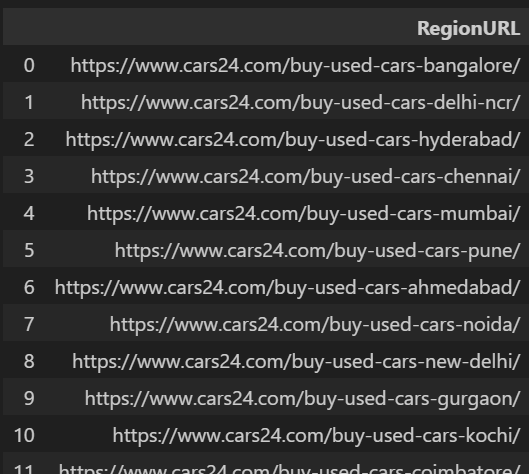

# Development of "UsedCarsIndia" - an R Package for used car price prediction

Preparatory work for JAIN Online MBA - Final year research project

This repository contains all the code and intermediate files created to extract, transform and create the final used cars dataset that will be made available as part of the [UsedCarsIndia](https://github.com/vkatti/UsedCarsIndia "Link to Github Repository") R Package.

The used cars data was extracted from following webistes:

-   https://www.cars24.com
-   https://www.carwale.com

The extraction process required a multi-step approach due to the nested nature of the websites. The folders in this repository mirror this multi-step approach.

Following is a quick description of the folders in this repository.

### 01_Regions

First we extracted the URLs of the webpages corresponding to the Regions serviced by the used car companies.

This folder contains the iPython Notebooks which extracts the base URLs of the Regions and stores them as a pickle (.pkl) file.

{.text-align:center fig-align="center"}
