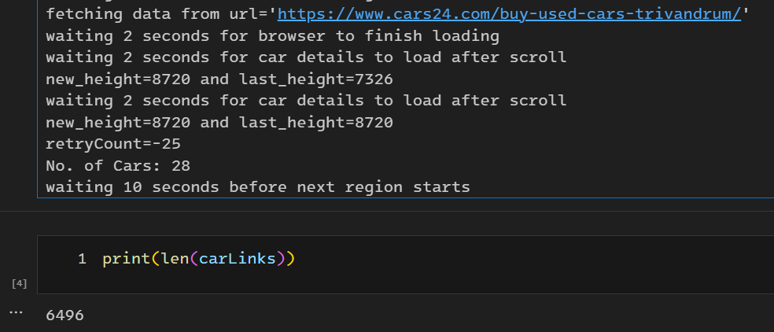
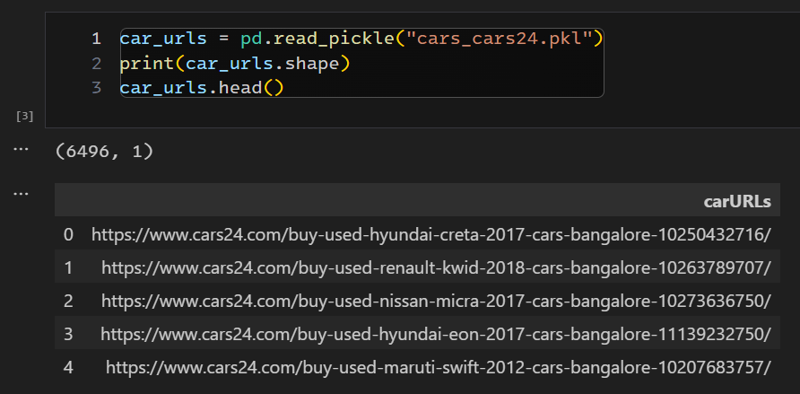
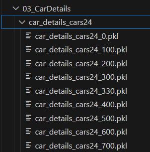
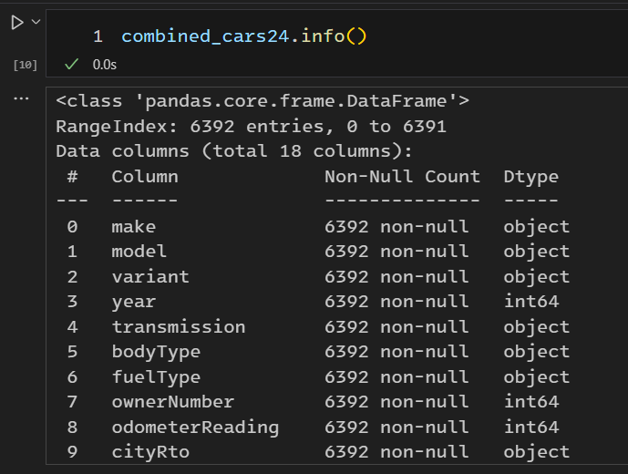

# Development of “UsedCarsIndia” - an R Package for used car price
prediction

-   [Introduction](#introduction)
-   [01_Regions](#regions)
-   [02_CarURLs](#carurls)
-   [03_CarDetails](#cardetails)
-   [04_CarDetailsConsolidated](#cardetailsconsolidated)
-   [05_CleanAndCombine](#cleanandcombine)

## Introduction

This repository is the preparatory work for JAIN Online MBA - Final year
research project. It contains all the code and intermediate files
created to extract, transform and create the final used cars dataset
that will be made available as part of the
[UsedCarsIndia](https://github.com/vkatti/UsedCarsIndia "Link to Github Repository")
R Package.

The used cars data was extracted from following webistes:

-   https://www.cars24.com
-   https://www.carwale.com

The extraction process required a multi-step approach due to the nested
nature of the websites. The folders in this repository mirror this
multi-step approach.

Following is a quick description of the folders in this repository.

## 01_Regions

First we extracted the URLs of the webpages corresponding to the Regions
serviced by the used car companies.

This folder contains the Jupyter (iPython) Notebooks which extracts the
base URLs of the Regions and stores them as a pickle (.pkl) file. This
was achieved using Pandas, Requests and BeautifulSoup libraries.

<figure>

<figcaption aria-hidden="true">A screenshot from the
regions_cars24.ipynb</figcaption>
</figure>

## 02_CarURLs

Once the URLs of the regions was available, then we extracted the URLs
of the individual cars listed on the Search Results.

This folder contains the Jupyter (iPython) Notebooks which extracts the
URLs of the Car Details pages and stores them as a pickle (.pkl) file.
This was achieved using Pandas, Requests, Selenium WebDriver and
BeautifulSoup libraries.

As the search results were Paginated i.e. the cars were listed in groups
of 20-24 with each set grouped under a single URL; we has to use
Selenium WebDriver to crawl through the search results to extract the
data from each page of the Search Results.

<figure>

<figcaption aria-hidden="true">A screenshot from
cars_cars24.ipynb</figcaption>
</figure>

<figure>

<figcaption aria-hidden="true">A screenshot from
car_details_cars24.ipynb</figcaption>
</figure>

## 03_CarDetails

This folder contains the Jupyter (iPython) Notebooks which extracts the
attributes of the used cars and stores them as a pickle (.pkl) file.
This was achieved using Pandas, Requests, Selenium WebDriver and
BeautifulSoup libraries.

After some adhoc exploration of the HTML Source code of the Car Detail
pages, we shortlisted the following columns for targeted extraction.
These were specifically shortlisted based on the availability of the
data for maximum number of cars and to limit the size of the data set.
There were other attributes but were missing for majority of the
entries.

-   make
-   model
-   variant
-   year
-   transmission
-   bodyType
-   fuelType
-   ownerNumber
-   odometerReading
-   cityRto
-   listingPrice
-   fitnessUpto
-   insuranceType
-   duplicateKey
-   city
-   registrationYear
-   registrationMonth
-   websiteUrl

The plan was to extract at least 10K used car details. This limit of 10K
was imposed solely with the intent to keep the dataset size in check.

Once the Car URLs were available, we then extracted individual car
details from their respective webpages. To ensure minimum loss of data,
we saved the car details in groups of 100 in intermediate pickle files.

<figure>

<figcaption aria-hidden="true">Intermediate Pickle (.pkl)
files</figcaption>
</figure>

## 04_CarDetailsConsolidated

This folder contains the Jupyter (iPython) Notebooks which combines all
pickle files containing car details and stores them as a Comma-delimited
(CSV) file. This was achieved using Pandas and Glob libraries.

<figure>

<figcaption aria-hidden="true">Combined Dataset</figcaption>
</figure>

## 05_CleanAndCombine

This folder contains a Quarto (.qmd) document that uses R to load the
CSV files, perform EDA, create the necessary tables and charts to be
included in the Project Report and finally, save the cleaned dataset
into .Rds format so that it can be made available in the
[UsedCarsIndia](https://github.com/vkatti/UsedCarsIndia "Link to Github Repository")
R Package.
